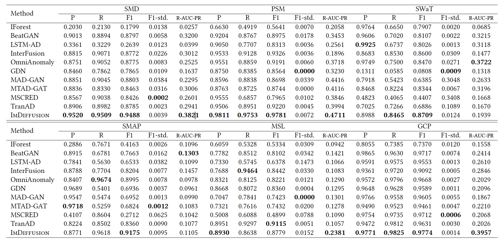

# IMDiffusion

This repository is the implementation of IMDiffusion: Imputed Diffusion Models for Multivariate Time Series Anomaly Detection. We propose the IMDiffusion framework for unsupervised anomaly detection and evaluate its performance on six open-source datasets.

# Results
The main results are presented in the following table. Our method outperforms the previous unsupervised anomaly detection methods in the majority of metrics.



# Data
To use the data mentioned in our paper, firstly download Machine.zip from https://drive.google.com/file/d/1VX5P60gS6fIJ_XDvnlF6M5fwJbWxwkNI/view?usp=sharing and put it in /data.
Please unzip Machine.zip in data. The data of SWaT has not been uploaded, and you need to apply by its official tutorial.

To use new dataset, please:

1. upload {dataset name}_train.pkl, {dataset name}_test.pkl, {dataset_name}_test_label.pkl
2. You need to add some code in exe_machine.py. If your dataset contains multiple sub datasets, you can refer to the practice of registering the names of each sub dataset in the SMD dataset. Meanwhile, please add its feature_dim parameter.
3. Please add feature_dim parameter in evaluate_machine_window_middle.py

# Train and inference


To reproduce the results mentioned in our paper, first, make sure you have torch and pyyaml installed in your environment. Then, use the following command to train:
```shell
python exe_machine.py --device cuda:0 --dataset SMD
```

To obtain the average performance of the model, we run six times for one dataset. You can modify this parameter according to your needs.

After completing the training, you can use the

```shell
python evaluate_machine_window_middle.py --device cuda:0 --dataset SMD
```

command to perform inference.

After inference, if you want to compute score, there are two scripts for compute score: compute_score.py and ensemble_proper.py.

compute_score.py is used to calculate the score of each dataset at each threshold. For individual data such as SWaT, SMAP, MSL, and PSM that do not contain sub datasets, you do not need to run this code.

If you want to compute score on SMD and GCP, firstly 
```shell
python compute_score.py --dataset_name SMD
```

then

```shell
python ensemble_proper.py --dataset_name SMD
```

else if you want to compute score for PSM, SWaT, MSL and SMAP, just use:

```shell
python ensemble_proper.py --dataset_name SWaT
```

you can check the result in ensemble_residual, we use a csv file to record average score, for example:

| average    |            |            |            |
| ---------- | ---------- | ---------- | ---------- |
| p          | r          | f1         | add        |
| 0.91759533 | 0.84315562 | 0.87865043 | 324.476196 |
| std        |            |            |            |
| p          | r          | f1         | add        |
| 0.01279164 | 0.01456169 | 0.00622323 | 17.4200802 |


# Cite this work

If you use this work, please cite using the following bibtex entry.

```markdown
@article{chen2023imdiffusion,
title={ImDiffusion: Imputed Diffusion Models for Multivariate Time Series Anomaly Detection},
author={Chen, Yuhang and Zhang, Chaoyun and Ma, Minghua and Liu, Yudong and Ding, Ruomeng and Li, Bowen and He, Shilin and Rajmohan, Saravan and Lin, Qingwei and Zhang, Dongmei},
journal={arXiv preprint arXiv:2307.00754},
year={2023}
}
```
